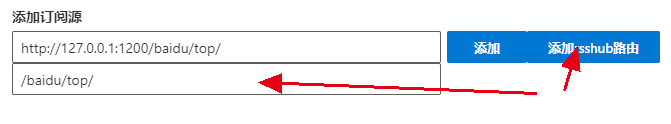

# 客制化

## 原始readme

[fluent-reader](https://github.com/yang991178/fluent-reader/blob/master/README.md)

### 开发指导

```bash
# Install dependencies
npm install

# Compile ts & dependencies
npm run build

# Start the application
npm run electron

# Generate certificate for signature
electron-builder create-self-signed-cert
# Package the app for Windows
npm run package-win

```

### Developed with

- [Electron](https://github.com/electron/electron)
- [React](https://github.com/facebook/react)
- [Redux](https://github.com/reduxjs/redux)
- [Fluent UI](https://github.com/microsoft/fluentui)
- [Lovefield](https://github.com/google/lovefield)
- [Mercury Parser](https://github.com/postlight/mercury-parser)

## 自定添加的特性

1. 支持rsshub中直接添加路由，不需要写完整url


